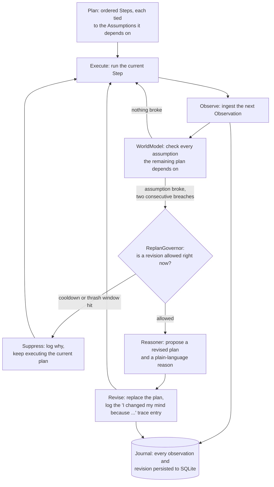

# Architecture

## The loop

Every tick runs the same four stages, whether or not anything changes:

1. **Plan.** A `Plan` is an ordered list of `Step`s. Nothing in a `Step`
   references assumptions directly; the assumptions live independently in
   the `WorldModel`, so a revised plan can depend on the same live beliefs
   without redeclaring them.
2. **Execute.** The current step runs (`advance`, `rollback`, `pause`,
   `open_incident`, `escalate`, `cleanup`). This is a pure state
   transition against `RunState`; there is no side channel back into the
   plan from here.
3. **Observe.** The environment (the scenario) produces one `Observation`
   per tick: an event, not a poll on a timer. A quiet environment
   produces zero observations worth acting on and therefore zero
   re-plans; the loop does not re-plan just because time passed.
4. **Re-evaluate.** `WorldModel.observe()` checks the new observation
   against every registered `Assumption`. An assumption is only reported
   broken after `breaches_to_trigger` consecutive failures (default 2),
   and only reported recovered after `recoveries_to_clear` consecutive
   successes. This hysteresis is the mechanism, not a fixed timer, that
   decides when the world model is no longer valid; see
   [FAILURE_TEST.md](FAILURE_TEST.md) for what happens without it.

## What happens when an assumption breaks

A broken assumption produces a `Contradiction`, not an automatic
revision. Three more things have to happen first:

1. **`ReplanGovernor.allow()`** decides whether a revision is allowed
   right now at all: a cooldown after the last revision, and a cap on how
   many revisions may happen inside a rolling window. If the cap is
   exceeded, the governor stops treating this as a signal-driven system
   and escalates to a human instead of continuing to hand out revisions.
   This is the containment mechanism, not an afterthought; see
   [FAILURE_TEST.md](FAILURE_TEST.md).
2. **`Reasoner.propose()`** turns the contradiction into a `Revision`: a
   new list of steps, plus a reason. The default `RuleBasedReasoner` looks
   up a deterministic playbook keyed by the assumption id (`_PLAYBOOK`).
   If no playbook covers the assumption that broke, it does not invent
   one: it escalates and says so explicitly
   (`latency_regression_unknown` demonstrates this path). This is the
   "mission-driven, not random re-prompting" property: the agent is
   reasoning about which of its own stated beliefs changed and why, not
   asking an LLM to freelance a new plan from scratch on every tick.
3. **The trace.** Every revision is logged with the exact evidence that
   caused it (which assumption, which metric, how many consecutive
   breaches, the raw values) and rendered as an `"I changed my mind
   because ..."` line. This is not a summary written after the fact; the
   reason is the same string the governor and the journal both see.

`ClaudeReasoner` (used automatically when `ANTHROPIC_API_KEY` is set) is
a thin wrapper: it always delegates the actual decision, the new steps,
to `RuleBasedReasoner`, and only asks the model to restate the reason in
plainer language. If that call fails for any reason (no network, bad
key, malformed response), the fallback is the deterministic reason text.
Nothing about what the agent does depends on the LLM call succeeding.

## Persistence

`Journal` (SQLite) writes three things as they happen, not at the end of
a run: every observation, every revision (with its evidence), and a
checkpoint of the current plan version and cursor after every tick. A
run's trace and final state both survive the process exiting, and
`Journal.load_state()` / `Journal.revisions_for()` let a later process
inspect or resume a run without replaying it from memory.

## Baseline comparison

`run_static()` and `run_adaptive()` both start from the identical `Plan`
and identical `Assumption`s and consume the identical observation stream
from the same `Environment`. The only difference is that `run_static()`
never looks at what it observes. Running both against one scenario is
the before/after: the static trace shows what would have happened
silently, the adaptive trace shows the revision and why.
